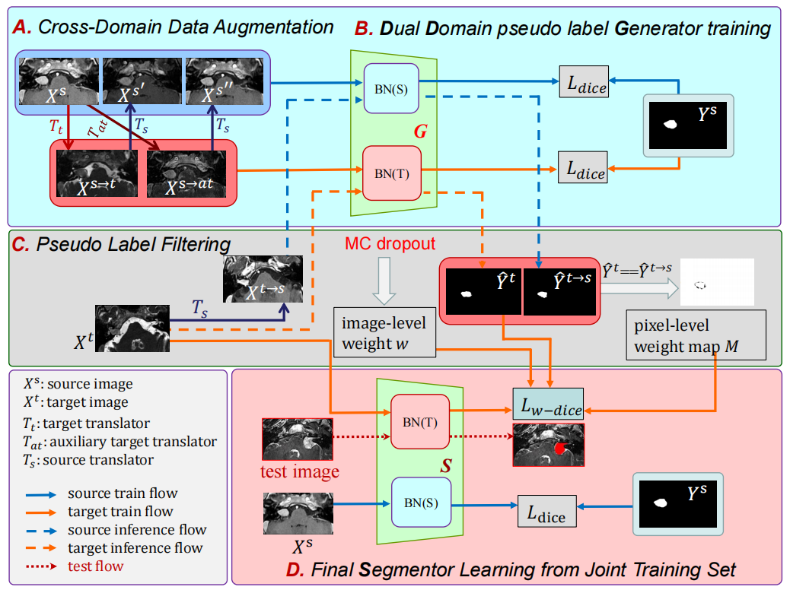

<!-- # FPL+
code for "FPL+: Filtered Pseudo Label-based Unsupervised Cross-Modality Adaptation for 3D Medical Image Segmentation"

The code is being gradually improved...

Train and test the FPL+:
```
export CUDA_VISIBLE_DEVICES=0
export PYTHONPATH=$PYTHONPATH:./PyMIC
python ./PyMIC/pymic/net_run_dsbn/net_run.py train ./config_dual/unet2d_dsbn_bst_t2s.cfg
python ./PyMIC/pymic/net_run_dsbn/net_run.py test ./config_dual/unet2d_dsbn_bst_t2s.cfg
``` -->


# FPL+: Filtered Pseudo Label-based Unsupervised Cross-Modality Adaptation for 3D Medical Image Segmentation
by [Jianghao Wu](https://jianghaowu.github.io/), et.al. 

## Introduction

This repository is for our IEEE TMI paper **FPL+: Filtered Pseudo Label-based Unsupervised Cross-Modality Adaptation for 3D Medical Image Segmentation**. 




## Data Preparation

### Dataset
[ Vestibular Schwannoma Segmentation Dataset](https://www.nature.com/articles/s41597-021-01064-w) | [BraTS 2020](https://www.med.upenn.edu/cbica/brats2020/data.html) | [MMWHS](http://www.sdspeople.fudan.edu.cn/zhuangxiahai/0/mmwhs/)

For VS dataset, preprocess original data according to `./data/preprocess_vs.py`.

### Cross domian data augmentation 
Training [CycleGAN](https://github.com/junyanz/pytorch-CycleGAN-and-pix2pix), and convert source domain data into source domian-like set and target domian-like set, refer the folder `./dataset`.

### File Organization
Using `./write_csv.py` to write your data into a `csv` file 

For vs data, ceT1 as the source domain, hrT2 as the target domain, the`csv `file can be seen in `./config_dual/data_vs`: 
``` 
├──config_dual/data_vs
    ├── [train_ceT1_like.csv]
        ├──image,label
        ├──./dataset/ceT1/img/vs_gk_99_t1.nii.gz,./dataset/ceT1/lab/vs_gk_99_t1_seg.nii.gz
        ├──./dataset/fake_data/ceT1-hrT2-ceT1_cc/vs_gk_99_t1.nii.gz,./dataset/ceT1/lab/vs_gk_99_t1.nii.gz
        ├──./dataset/fake_data/ceT1-hrT2-ceT1_ac/vs_gk_99_t1.nii.gz,./dataset/ceT1/lab/vs_gk_99_t1.nii.gz
        ...
    ├── [train_hrT2_like.csv]
        ├──image,label
        ├──./dataset/fake_data/ceT1-hrT2_cyc/vs_gk_99_t1.nii.gz,./dataset/ceT1/lab/vs_gk_99_t1.nii.gz
        ├──./dataset/fake_data/ceT1-hrT2_auxcyc/vs_gk_99_t1.nii.gz,./dataset/ceT1/lab/vs_gk_99_t1.nii.gz
        ...
```

## Training and Testing

### Train pseudo labels generator and get pseudo label
Write your training config file in `config_dual/vs_t1s_g.cfg`

```
export CUDA_VISIBLE_DEVICES=0
export PYTHONPATH=$PYTHONPATH:./PyMIC
## train pseudo label generator
python ./PyMIC/pymic/net_run_dsbn/net_run.py train ./config_dual/vs_t1s_g.cfg
## get pseudo label
python ./PyMIC/pymic/net_run_dsbn/net_run.py test ./config_dual/vs_t1s_g.cfg
## get the pseudo label of fake source image
python ./PyMIC/pymic/net_run_dsbn/net_run.py test ./config_dual/vs_t1s_g_fake.cfg
## get image-level weights
python ./PyMIC/pymic/net_run_dsbn/net_run.py test ./config_dual/vs_t1s_weights.cfg
```
Weights are saved on `[testing][fpl_uncertainty_sorted]` and `[testing][fpl_uncertainty_weight]`, run:
```
python data/get_pixel_weight.py
python data/get image_weight.py
```
### Train final segmentor
```
export CUDA_VISIBLE_DEVICES=0
export PYTHONPATH=$PYTHONPATH:./PyMIC
python ./PyMIC/pymic/net_run_dsbn/net_run.py train ./config_dual/vs_t1s_S.cfg
python ./PyMIC/pymic/net_run_dsbn/net_run.py test ./config_dual/vs_t1s_S.cfg
```


<!-- ## Acknowledgement
The U-Net model is borrowed from [Fed-DG](https://github.com/liuquande/FedDG-ELCFS). The Style Augmentation (SA) module is based on the nonlinear transformation in [Models Genesis](https://github.com/MrGiovanni/ModelsGenesis). The Dual-Normalizaiton is borrow from [DSBN](https://github.com/wgchang/DSBN). We thank all of them for their great contributions. -->

## Citation
If you find this project useful for your research, please consider citing:

```bibtex
@article{wu2024fpl+,
  title={FPL+: Filtered Pseudo Label-based Unsupervised Cross-Modality Adaptation for 3D Medical Image Segmentation},
  author={Wu, Jianghao and Guo, Dong and Wang, Guotai and Yue, Qiang and Yu, Huijun and Li, Kang and Zhang, Shaoting},
  journal={IEEE Transactions on Medical Imaging},
  year={2024},
  publisher={IEEE}
}
``` 
